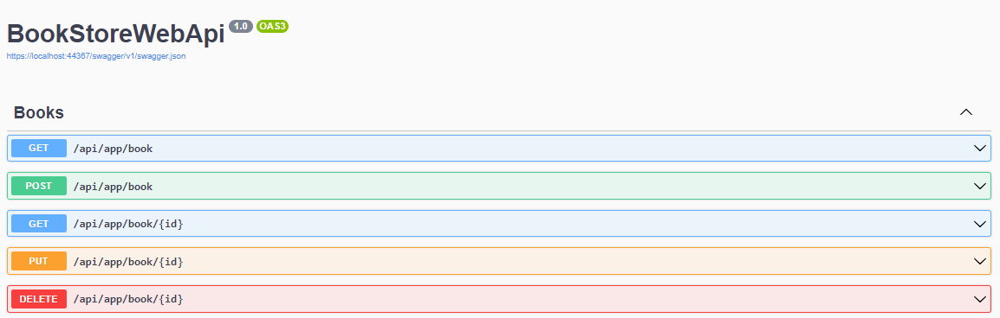

# Create a generic HTTP Service to consume a CRUD API

## Introduction

In this step-by-step tutorial, I will show you how you can create a **generic HTTP Service** that consumes a **.NET Core WEB API**.

To simplify things, we will create a standard **.NET Core WEB API** (BookStoreWebApi) and a **.NET Core Console** (BookStoreConsole) application to implement a **generic HTTP Service** that consumes a **C# CRUD API**.

## Requirements

- .NET 8.0 SDK
- VsCode, Visual Studio 2022 or another compatible IDE

In the [GitHub repo](https://github.com/bartvanhoey/AbpOpenIddictRepo) you can find the **BookStoreWebApi** and **BookStoreConsole**

## Development

### Create a new .NET Core WEB API

Let's first create a .NET Core WEB API with a BooksController with the standard CRUD API endpoints.

```bash
    dotnet new webapi --use-controllers -o BookStoreWebApi
```

### Copy Data/Infra/Dtos folders

Copy/paste the Data/Infra and Dtos folder of the BookstoreWebApi sample project into the root of your project.

### Add a BooksController class to the Controllers folder

```csharp
using BookStoreWebApi.Dtos.Books;
using BookStoreWebApi.Infra;
using Microsoft.AspNetCore.Mvc;
using static BookStoreWebApi.Data.BooksResolver;

namespace BookStoreWebApi.Controllers
{
    [Route("api/app/book")]
    [ApiController]
    public class BooksController : ControllerBase
    {
        [HttpGet]
        public PagedResultDto<BookDto> Get() => new() { Items = BookItems, TotalCount = BookItems.Count };

        [HttpGet("{id}")]
        public BookDto? Get(Guid id) => BookItems.FirstOrDefault(x => x.Id == id);

        [HttpPost]
        public BookDto Create([FromBody] CreateBookDto createBookDto)
        {
            BookItems.Add(new BookDto(createBookDto.Name,createBookDto.Type,createBookDto.Price,  createBookDto.PublishDate, createBookDto.Id));
            return BookItems.Single(x => x.Id == createBookDto.Id);
        }

        [HttpPut("{id}")]
        public BookDto? Put(Guid id, [FromBody] UpdateBookDto updateBookDto)
        {
            var bookDto = BookItems.FirstOrDefault(x => x.Id == id);
            if (bookDto == null) return bookDto;
            bookDto.Name = updateBookDto.Name;
            bookDto.Price = updateBookDto.Price;
            bookDto.PublishDate = updateBookDto.PublishDate;
            bookDto.Type = updateBookDto.Type;
            return bookDto;
        }

        [HttpDelete("{id}")]
        public void Delete(Guid id)
        {
            var bookDto = BookItems.FirstOrDefault(x => x.Id == id);
            if (bookDto != null) BookItems.Remove(bookDto);
        }
    }
}

```

### Run the API



## Create a .NET Console app

```bash
    dotnet new console -o BookStoreConsole
```

### Create a IHttpService interface

Create a **IHttpService interface** with the standard CRUD method definitions in the **Services/Http** folder

```csharp
public interface IHttpService<T, in TC, in TU, in TG, in TD>
{
    Task<ListResultDto<T>> GetListAsync(string uri, TG? getListRequestDto = default);
    Task<ListResultDto<T>> UpdateAsync(string uri, TU updateInputDto);
    Task<T> CreateAsync(string uri, TC createInputDto);
    Task<T> GetAsync(string uri);
    Task DeleteAsync(string uri, TD id);
}
```

Copy/Paste the **Infra** folder of the **BookStoreConsole** sample application into the **Services/Http** folder

Create a **HttpService class** in the **Http** folder that implements the **IHttpService interface**

```csharp
using System.Net.Http.Json;
using BookStoreConsole.Services.Http.Infra;

namespace BookStoreConsole.Services.Http;

public class HttpService<T, TC, TU, TL, TD> : HttpServiceBase<TL>, IHttpService<T, TC, TU, TL, TD>
    where T : class 
    where TC : class
    where TU : class
    where TL : class
{
    public async Task<ListResultDto<T>> GetListAsync(string uri, TL? getListRequestDto = default)
    {
        if (getListRequestDto == null) return new ListResultDto<T>();
        var httpResponse = await (await GetHttpClientAsync()).Value.GetAsync(ComposeUri(uri, getListRequestDto));
        httpResponse.EnsureSuccessStatusCode();
        var json = await httpResponse.Content.ReadAsStringAsync();
        if (json == "[]" || json.IsNullOrWhiteSpace()) return new ListResultDto<T>();
        if (getListRequestDto is IPagedRequestDto)
        {
            var pagedResultDto = json.ToType<PagedResultDto<T>>();
            return new PagedResultDto<T>(pagedResultDto.TotalCount,pagedResultDto.Items);
        }
        return new ListResultDto<T>(json.ToType<List<T>>());
    }

    public async Task<ListResultDto<T>> UpdateAsync(string uri, TU updateInputDto)
    {
        var httpResponse = await (await GetHttpClientAsync()).Value.PutAsJsonAsync($"{uri}", updateInputDto);
        httpResponse.EnsureSuccessStatusCode();
        var json = await httpResponse.Content.ReadAsStringAsync();
        if (json == "[]" || json.IsNullOrWhiteSpace()) return new ListResultDto<T>();

        if (json.StartsWith("{") && json.EndsWith("}"))
            return new ListResultDto<T>(new List<T> { json.ToType<T>() });

        return new ListResultDto<T>(json.ToType<List<T>>());
    }

    public async Task<T> CreateAsync(string uri, TC createInputDto)
    {
        var httpResponse = await (await GetHttpClientAsync()).Value.PostAsJsonAsync(uri, createInputDto);
        httpResponse.EnsureSuccessStatusCode();
        return (await httpResponse.Content.ReadAsStringAsync()).ToType<T>();
    }

    public async Task CreateManyAsync(string uri, IEnumerable<TC> createInputDto)
    {
        var httpResponse = await (await GetHttpClientAsync()).Value.PostAsJsonAsync($"{uri}/many", createInputDto);
        httpResponse.EnsureSuccessStatusCode();
    }

    public async Task<T> GetAsync(string uri)
    {
        var httpResponse = await (await GetHttpClientAsync()).Value.GetAsync(uri);
        httpResponse.EnsureSuccessStatusCode();
        return (await httpResponse.Content.ReadAsStringAsync()).ToType<T>();
    }

    public async Task DeleteAsync(string uri, TD id)
    {
        var httpResponse = await (await GetHttpClientAsync()).Value.DeleteAsync($"{uri}/{id}");
        httpResponse.EnsureSuccessStatusCode();
    }
}
```

### Create a IBookService interface

Copy/Paste the **Services/Books/Dtos** folder of the **BookStoreConsole** sample application into the **Services/Books/Dtos** folder

Create an **IBookService interface** in the **Services/Books** folder.

```csharp
using BookStoreConsole.Services.Books.Dtos;

namespace BookStoreConsole.Services.Books;

public interface IBookService
{
    Task<IEnumerable<BookDto>> GetBooksAsync();
    Task<BookDto?> CreateBookAsync(CreateBookDto bookDto);
    // find other method definitions in the BookStoreConsole sample project ...
}
```

Create an **BookService class** in the **Services/Books** folder.
As you can see, the BookService class gets the correct HttpService via Constructor Dependency Injection

```csharp
using BookStoreConsole.Services.Books.Dtos;
using BookStoreConsole.Services.Http;

namespace BookStoreConsole.Services.Books;

public class BookService(IHttpService<BookDto, CreateBookDto, UpdateBookDto, GetBooksPagedRequestDto, Guid> httpService, string bookApiUrl) : IBookService
{
    public async Task<IEnumerable<BookDto>> GetBooksAsync()
        => (await httpService.GetListAsync($"{bookApiUrl}", new GetBooksPagedRequestDto())).Items;

    public async Task<BookDto?> CreateBookAsync(CreateBookDto bookDto)
        => await httpService.CreateAsync($"{bookApiUrl}", bookDto);
    // find other methods in the BookStoreConsole sample project ...
}
```

## Program.cs

```bash
    dotnet add package Microsoft.Extensions.DependencyInjection
```

```csharp
using BookStoreConsole.Services.Books;
using BookStoreConsole.Services.Books.Dtos;
using BookStoreConsole.Services.Http;
using Microsoft.Extensions.DependencyInjection;

// Create a ServiceCollection for the Dependency Injection
var services = new ServiceCollection();

// Add the HttpService to the the Dependency Injection System
services.AddTransient<IHttpService<BookDto, CreateBookDto, UpdateBookDto, GetBooksPagedRequestDto, Guid>,
    HttpService<BookDto, CreateBookDto, UpdateBookDto, GetBooksPagedRequestDto, Guid>>();

// Add the BookService to the the Dependency Injection System
const string bookApiUrl = "https://localhost:44336/api/app/book";
services.AddTransient<IBookService, BookService>(options
    => new BookService(
        options
            .GetRequiredService<IHttpService<BookDto, CreateBookDto, UpdateBookDto, GetBooksPagedRequestDto, Guid>>(),
        bookApiUrl));

// Get the BookService from the Dependency Injection System
var bookService = services.BuildServiceProvider().GetRequiredService<IBookService>();

// Add a new book
var createdBook = await bookService.CreateBookAsync(new CreateBookDto("New Book3", BookType.Adventure, DateTime.Now, 10.0f));

// Get all the books
var books = await bookService.GetBooksAsync();

Console.ReadLine();

```

Get the [source code](https://github.com/bartvanhoey/AbpOpenIddictRepo) on GitHub.

Enjoy and have fun!
